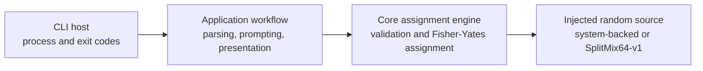

# Architecture

The modern solution separates input/output concerns from assignment rules.

`HyphyOregon.ConferenceGenerator.Core` owns immutable domain models,
validation, balanced assignment, and the bounded-random interface. It has no
console, filesystem, environment, network, process, logging, or UI access.

`HyphyOregon.ConferenceGenerator.Cli` depends on Core and supplies argument
parsing, interactive prompting through injected text streams, presentation,
random-source composition, safe diagnostics, cancellation, and exit-code
mapping.

The test project depends on both production projects. Production projects
never depend on tests. Randomness points inward through Core's
`IBoundedRandomSource`, so seeded and system-backed behavior can be tested
without coupling the domain engine to console or runtime state.
